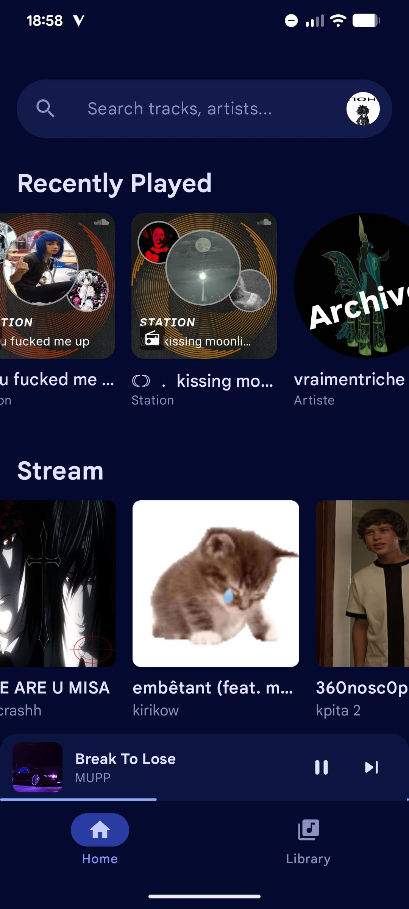
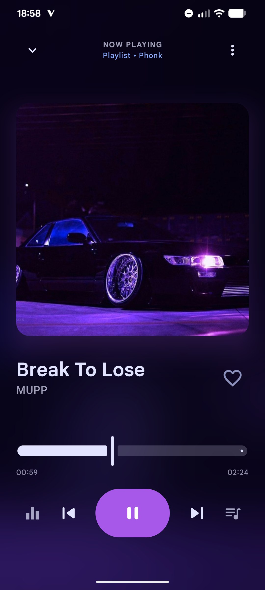

# kittytune ( ◡‿◡ *)

### the soundcloud player you've always wanted.

hi everyone! welcome to **kittytune**. if you are looking for a **better, cuter, and more powerful way to listen to soundcloud** on android, you just found it! (ﾉ◕ヮ◕)ﾉ*:･ﾟ✧

it's not just a music player; it's a complete upgrade over the official app. cleaner design, audio effects, real lyrics, and it plays your local files too.

i just released the very first version! you can grab the **apk** right now in the [releases](https://github.com/alan7383/kittytune/releases) tab.

---

### look how pretty it is! ( o . o )

  
  
  
  

---

### why switch to kittytune? (¬‿¬)

i built this because i wanted features that the official app just doesn't have:

*   **the best of both worlds:** stream from **soundcloud** (sync your likes, follow artists) AND play your **local mp3 files**. everything in one place.
*   **audio wizardry:** ever wanted to listen to a track in **nightcore** (speed up)? or maybe **slowed + reverb**? kittytune does this in real-time! there is also **8d audio** and a **bass boost** for the drops.
*   **gamification:** listening gives you **XP**! level up, keep a daily streak, and unlock secret achievements. ( > ᴗ < )
*   **material you:** the app adapts to your wallpaper colors. it feels like it belongs on your phone.
*   **lyrics:** automated synced lyrics for almost every song.
*   **privacy:** use the **guest mode** to listen without even logging in.

### how it works (under the hood) (⌐■_■)

if you are a dev curious about the code, here is a deeper dive into how i built this. the project is written 100% in [kotlin](https://kotlinlang.org/) and follows the **mvvm** architecture. i built the ui entirely with [jetpack compose](https://developer.android.com/jetpack/compose) for that smooth, modern feel.

for the audio engine, i am using [media3 (exoplayer)](https://developer.android.com/media/media3), but i had to get creative to make the effects work. i wrote custom audio processors (you can peek at [`ui/player/audio/`](app/src/main/java/com/alananasss/kittytune/ui/player/audio/)) where i manipulate the `ByteBuffer` directly to create the **8d auto-pan**, the biquad filters for the bass boost, and the delay buffer for the reverb effect.

connecting to soundcloud's api is a bit tricky, so i built a `SessionManager` that runs a hidden, background webview. it basically acts like a real user to scrape a valid `client_id` and authentication tokens, which means the app keeps working even if the keys change. for the lyrics, i use the [lrclib](https://lrclib.net/) api and [mp3agic](https://github.com/mpatric/mp3agic) for local tags. everything is stored locally using a [room database](https://developer.android.com/training/data-storage/room).

### contributing & bugs ( ˙꒳​˙ )

since this is the very first release (v1.0 beta), there might be some tiny bugs hiding around.

if you find one, or if you have a crazy idea for a new feature, **please tell me**! open an issue or start a discussion. i am totally open to suggestions and i'd love to make this the best player out there.

### want to help translate? ( ˘ ³˘)♥

i want kittytune to be available for everyone! right now we support english, french, and hungarian.

if you want to see the app in your language, it's super easy to help. just look into the [`res/values`](app/src/main/res/values) folder. you can copy the `strings.xml` file, translate the lines inside, and open a pull request. i would be super happy to add your name to the credits!

---

thanks for stopping by. happy listening!
~ alan (´｡• ᵕ •｡`)
